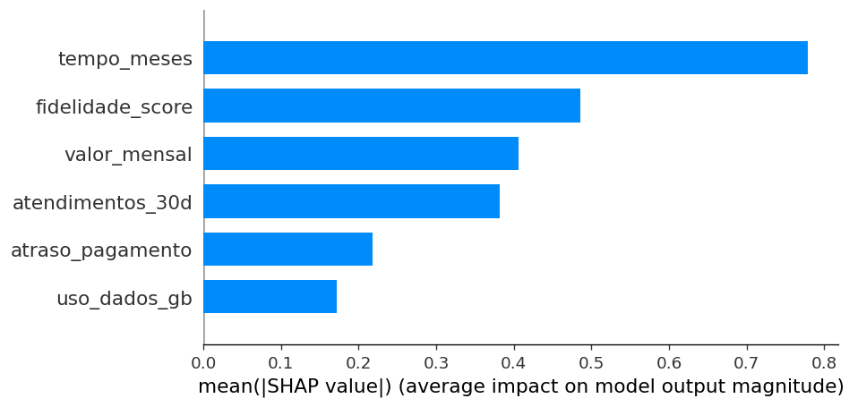

# 16 — Classificador de Churn + SHAP

> **Carreira Alura:** Engenharia de Agentes — Nível 2 (*Machine Learning*)

Pipeline completo de ML supervisionado: dataset sintético de telecom, **XGBoost** para prever churn, **SHAP** para interpretabilidade global e local, e dashboard **Streamlit** para explorar predições.

## Stack
| Camada | Tecnologia |
|--------|------------|
| Modelo | `xgboost`, `scikit-learn` |
| Interpretabilidade | `shap` |
| Dashboard | `streamlit` |

## Como rodar

```bash
pip install -r requirements.txt
python train.py                     # gera modelo.pkl + métricas
streamlit run dashboard.py          # explora interpretabilidade
```

## Output de exemplo

Treino em ~5s no dataset sintético de 4 mil clientes:
```bash
$ python train.py
AUC=0.752  artefatos em out/
```

`out/metrics.json` (extrato):
```json
{"auc": 0.752, "accuracy": 0.735,
 "precision_churn": 0.61, "recall_churn": 0.42, "f1_churn": 0.50,
 "n_train": 3200, "n_test": 800}
```

Importância global SHAP (200 amostras):



`fidelidade_score` e `tempo_meses` dominam — coerente com o gerador (baixa fidelidade + pouco tempo de casa = alta probabilidade de churn).

## Entregáveis para portfólio
- AUC, precision, recall, matriz de confusão
- Feature importance via SHAP (global + waterfall por amostra)
- Dashboard interativo com sliders de features
